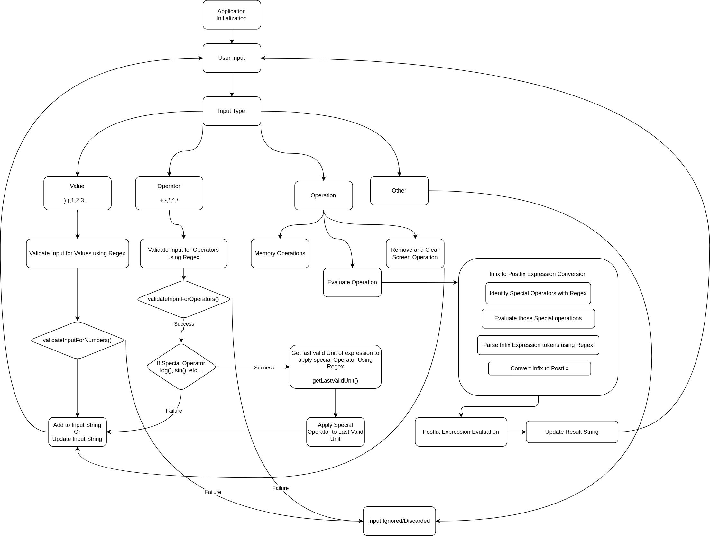

# JS-Assignments

## Assignment1 - Scientific Calculator

### How to Run this Application ?

- This Assignment utilizes Javascript Modules so just opening the HTML file with Web Browser won't work. It will require a Web Server.

- You can use VSCode [Live Server](https://marketplace.visualstudio.com/items?itemName=ritwickdey.LiveServer) Extension, which provides a Web server to host Current Working Directory in VSCode.

- If you have Node.js Installed on your system then,    
    - You can also use `npx serve <directory_name>` to start a Basic Web Server for Static content serving.

- Thats all. Once the Application is deployed it can be visited on *Localhost* or over *LAN*.

### The flow of Scientific Calculator

